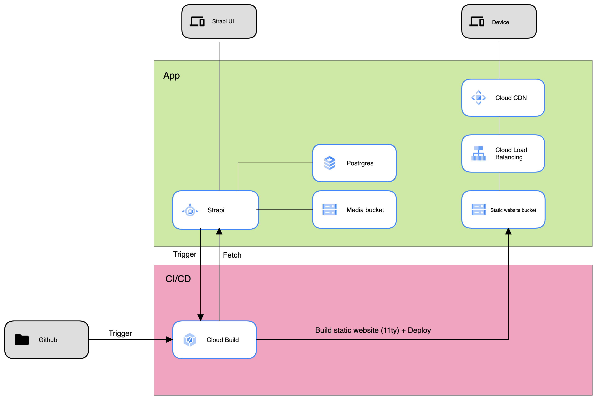

# Jamstack on Google Cloud

## Summary
- [Strapi CMS](https://strapi.io/) deployed on AppEngine
- Content on Postgres (Cloud SQL) / Media on a Cloud Storage bucket
- Static [11ty](https://www.11ty.dev/) site deployed on Cloud Storage + Cloud CDN
- Cloud build pipeline triggered by a Strapi webhook to update website with new content
- [nip.io](https://nip.io/) is used for simplicity, to provide a https url

## Architecture


## Installation
- Get a GCP project with a linked billing account
- Create app engine application
- Create a bucket for terraform state
- Fork this repository
- [Connect your forked repository to Cloud Build](https://cloud.google.com/build/docs/automating-builds/github/connect-repo-github)
- Set config files from templates (infra/backend.conf.template & infra/terraform.tfvars.template)

### *infra/backend.conf*

| Property | Description |
|---|---|
| bucket | Name of the terraform state bucket |
| prefix | Prefix for state files in the bucket (usually tfstate/) |

### *infra/terraform.tfvars*

| Property | Description |
|---|---|
| project_id | GCP project id. |
| service_src_bucket | Name of the bucket that will be created to store app engine sources. |
| strapi_app_keys | See [app.keys](https://docs.strapi.io/developer-docs/latest/setup-deployment-guides/configurations/required/server.html#available-options). You can set random strings separated by a comma. |
| strapi_api_token_salt | See [apiToken.salt](https://docs.strapi.io/developer-docs/latest/setup-deployment-guides/configurations/required/admin-panel.html#available-options). You can set a random string. |
| strapi_admin_jwt_secret | See [auth.secret](https://docs.strapi.io/developer-docs/latest/setup-deployment-guides/configurations/required/admin-panel.html#available-options). You can set a random string. |
| strapi_jwt_secret | See [JWT configuration](https://docs.strapi.io/developer-docs/latest/plugins/users-permissions.html#jwt-configuration). You can set a random string. |
| strapi_media_bucket | Name of the bucket that will be created to store strapi media files. |
| front_bucket | Name of the bucket that will be created to store 11ty static website. |
| repository_owner | Owner of the forked bucket (https://github.com/<repository_owner>/<repository_name>). |
| repository_name | Name of the forked bucket (https://github.com/<repository_owner>/<repository_name>). |

### Run terraform

``` bash
terraform init -backend-config=backend.conf
terraform plan
terraform apply
````

Note the outputs: 
``` bash
Outputs:

front_url = "<ip>.nip.io"
strapi_url = "https://strapi-dot-<project_id>.appspot.com/admin"
```

- Browse [Cloud Build triggers page](https://console.cloud.google.com/cloud-build/triggers) on the GCP console
- Click on webhook-trigger
- Click on SHOW URL PREVIEW and copy the webhook url
- Browse Strapi url (url in the terraform outputs)
- Create an admin account
- Go to Settings > Webhooks
- Create a new webhook: set a name > paste the webhook url > enable Entry events > Save
- Go to Settings > USERS & PERMISSIONS PLUGIN > Roles
- Add a new role: Post > enable find & findOne > Save
- Go to Content Manager > Post
- Add a new entry with some images in the content and publish it
- You shoud see a new build triggered in the Cloud Build page
- Once the build is completed, browse the front url (url in the terraform outputs) and you should find your post in the Blog section
